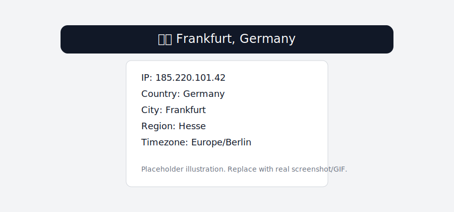

# IP Region Bar

[](https://github.com/svishniakov/ip-region-bar/actions/workflows/build.yml)
[](LICENSE)
[](https://support.apple.com/en-us/102861)

Native macOS menu bar app that shows your current external IP geolocation in real time.

## Highlights

- Zero onboarding: works immediately after install
- Local geolocation lookup via bundled DB-IP Lite `.mmdb`
- Privacy-first: no third-party geolocation API calls
- Offline-ready: shows last known region when the network is down
- Auto refresh on network/VPN changes

## Screenshot



## Installation (Homebrew)

```bash
brew tap svishniakov/ip-region-bar
brew install --cask ipregionbar
```

## First Launch Note (Without Apple Notarization)

This project currently ships without Apple Developer notarization.
If macOS blocks launch after Homebrew install, run:

```bash
xattr -dr com.apple.quarantine /Applications/IPRegionBar.app
```

## Update (Homebrew)

```bash
brew upgrade --cask ipregionbar
```

## Manual Installation

1. Open [Releases](https://github.com/svishniakov/ip-region-bar/releases)
2. Download `IPRegionBar.dmg`
3. Move `IPRegionBar.app` to `Applications`
4. Launch the app

## Build from Source

### Requirements

- macOS 13+
- Xcode 15 Command Line Tools
- SwiftLint (`brew install swiftlint`)

### Build

```bash
make build
```

### Package DMG

```bash
make dmg
```

## Database Updates

Monthly DB-IP Lite updates are handled by:

- CI workflow: `.github/workflows/update-db.yml`
- Local script: `bash scripts/update-dbip.sh`

## Attribution (Required by DB-IP License)

This product includes IP geolocation data created by DB-IP.com, available from [https://db-ip.com](https://db-ip.com).

## Privacy

- External IP is fetched from IP-only providers (`api64.ipify.org` / `checkip.amazonaws.com`)
- Geolocation is resolved locally from bundled/user DB-IP `.mmdb`

## Contributing

See [CONTRIBUTING.md](CONTRIBUTING.md).

## License

MIT — see [LICENSE](LICENSE).
